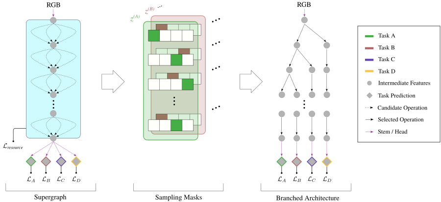

# Branched Multi-Task Architecture Search (BMTAS)

This repository provides example code for the BMVC 2020 paper [Automated Search for Resource-Efficient Branched Multi-Task Networks](https://arxiv.org/abs/2008.10292).



## Overview

BMTAS is a principled method to automatically find branched multi-task networks for a given set of tasks. The goal is to obtain models which are both high-performing and efficient during inference. This is achieved by optimizing a supergraph through differentiable neural architecture search. The desired performance vs. efficiency trade-off is controlled via a proxyless, resource-aware loss.

We provide example code for searching branched networks based on a MobileNetV2 backbone and DeepLabv3+ head on the PASCAL-Context dataset. The dataset provides labels for five dense prediction tasks: semantic segmentation, human parts segmentation, saliency estimation, surface normal estimation and edge detection.

## Usage

### Requirements

The code was run in a `conda` environment, using Python 3.7 with the following packages:

```bash
conda install pytorch==1.4.0 torchvision==0.5.0 cudatoolkit=10.1 -c pytorch
conda install scikit-image==0.16.2 tensorboard==2.2.1
conda install opencv==4.4.0 -c conda-forge
```

### Architecture Search

To start an architecture search, use for example:

```bash
python main_search.py --data_root . --tasks semseg,human_parts,sal,normals,edge --resource_loss_weight 0.05
```

On the first run, this will also download the dataset.

### Branched Network Training

To train the branched network found via architecture search, supply the path to the corresponding `branch_config.json`:

```bash
python main_branched.py --configuration </path/to/branch_config> --data_root . --tasks semseg,human_parts,sal,normals,edge
```

Due to GPU memory constraints, multi-GPU training may be required. By default, branched network training is distributed across all available GPUs on the node.

### Evaluation

To evaluate a trained branched network, supply the path to the corresponding `checkpoint.pth`:

```bash
python main_test.py --model_path </path/to/checkpoint> --data_root .
```

Note that the evaluation of edge detection is disabled, since the MATLAB-based [SEISM](https://github.com/jponttuset/seism) repository was used for obtaining the optimal dataset F-measure scores. Instead, the edge predictions are simply saved on the disk in this code.

## Differences to Paper Version

There are some minor differences between this version and the original code used for the paper:
- We use the Adam optimizer also for weights during the search - this way, we can avoid using a learning rate scheduler in the bilevel optimization.
- The learning rate is kept equal for all blocks when training the branched network, not adapted depending on the degree of operator sharing.

## Citation

If you found this code useful in your research, please consider citing the paper:

```bibtex
@InProceedings{bruggemann2020automated,
  Title     = {Automated Search for Resource-Efficient Branched Multi-Task Networks},
  Author    = {Bruggemann, David and Kanakis, Menelaos and Georgoulis, Stamatios and Van Gool, Luc},
  Booktitle = {BMVC},
  Year      = {2020}
}
```

## License

The code in this repository is released under the MIT license. However, care should be taken to adopt appropriate licensing for third-party code. Files containing third-party code are clearly marked accordingly at the top.
